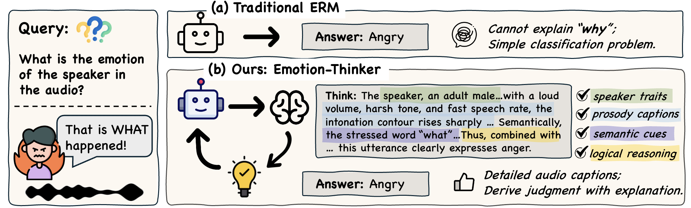

# EmotionThinker

EmotionThinker is a reinforcement learning–enhanced Speech Large Language Model (SpeechLLM) framework designed for interpretable speech emotion reasoning.

Data, model, and code will be made publicly available.

  
<strong>EmotionThinker, an RL–enhanced SpeechLLM framework that offers the following advantages: (1) higher emotion recognition accuracy; (2) deep reasoning ability to integrate emotion-related cues for justification; (3) fine-gained audio caption covering speaker traits, prosodic cues and semantic information.</strong>

