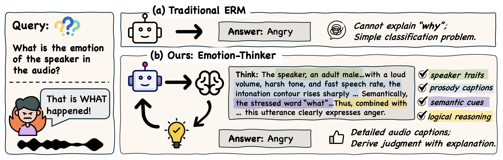

<div align="center">
    <h1>
    EmotionThinker
    </h1>
Official repository of the ICLR 2026 (Oral) paper  
<b><em>"EmotionThinker: Prosody-Aware Reinforcement Learning for Explainable Speech Emotion Reasoning".</em></b> 
For details, please refer to our  
<a href="https://arxiv.org/pdf/2601.15668">Paper</a>.
<br><br>

<br><br>

<a href="https://arxiv.org/pdf/2601.15668">

</a>

<a href="https://huggingface.co/ddwang2000/EmotionThinker">

</a>

<a href="https://github.com/dingdongwang/EmotionThinker_tmp/tree/main/EmotionCoT">

</a>

</div>


## Introduction

**EmotionThinker** is the first RL–enhanced SpeechLLM framework for interpretable speech emotion reasoning.

Unlike conventional speech emotion recognition (SER) systems that treat emotion as a flat classification problem, EmotionThinker reframes SER as a deep reasoning problem, enabling models to jointly produce accurate emotion labels and **structured, human-aligned explanations**.

EmotionThinker offers the following advantages: 

- Higher emotion recognition accuracy compared to existing SpeechLLMs; 
- Deep reasoning ability to integrate emotion-related cues for justification; 
- Fine-grained audio caption covering speaker traits, prosodic cues and semantic information. 

EmotionThinker consistently surpasses state-of-the-art SpeechLLMs in both emotion accuracy and explanation quality, advancing speech emotion understanding toward *interpretable, multimodal reasoning*.

## News

- [Feb. 12, 2026] We open-source the **EmotionThinker** pretrained model on [Hugging Face](https://huggingface.co/ddwang2000/EmotionThinker).

- [Feb. 12, 2026] We release the **EmotionCoT dataset** in this GitHub repository.

- [Feb. 05, 2026] 🎉 EmotionThinker is selected for **Oral Presentation** at ICLR 2026.

- [Jan. 26, 2026] 🎉 EmotionThinker is accepted to **ICLR 2026**. See you in Brazil! 🇧🇷

## Inference with EmotionThinker

**Step 0: Prepare invironment**

```bash
conda create -n emotionthinker python=3.10
conda activate voicebench
pip install torch==2.8.0 torchvision==0.23.0 torchaudio==2.8.0 --index-url https://download.pytorch.org/whl/cu128
pip install -r requirements.txt
```

**Step 1: Download EmotionThinker Model**

Download the pretrained EmotionThinker model from [Hugging Face](https://huggingface.co/ddwang2000/EmotionThinker). Set the local model path accordingly.

**Step 2: Run Inference Code**

```
python scripts/emotionthinker_infer.py
```

## EmotionCoT 

The **EmotionCoT** section provide structured prosody labeling and Chain-of-Thought (CoT) emotion reasoning annotations for speech emotion understanding, and related automatic labeling pipeline.

### EmotionCoT Datasets

> **Pre-request:** EmotionCoT does not redistribute audio files. Please download the original datasets from the official sources:
- [IEMOCAP](https://sail.usc.edu/iemocap/)
- [MELD](https://github.com/declare-lab/MELD)
- [Expresso](https://speechbot.github.io/expresso/)
- [EARS](https://github.com/facebookresearch/ears_dataset)
- [MSP-Podcast](https://www.lab-msp.com/MSP/MSP-Podcast.html)

**EmotionCoT Annotations:** We provide prosody labeling and CoT-style emotion reasoning annotations for: IEMOCAP, MELD, Expresso, EARS, MSP-Podcast (partial). Details refer to the JSONL files: `EmotionCoT/data/*.jsonl`

### Automatic Labeling Pipeline

To facilitate large-scale labeling and data augmentation, we provide an automated prosody labeling pipeline for EmotionCoT.

**Step 0: Prepare invironment**

> Note: If you have already prepared the environment during EmotionThinker inference stage, you may skip this step.

```bash
conda create -n emotionthinker python=3.10
conda activate voicebench
pip install torch==2.8.0 torchvision==0.23.0 torchaudio==2.8.0 --index-url https://download.pytorch.org/whl/cu128
pip install -r requirements.txt
```

**Step 1: Download Required Models**

Before running the pipeline, download the required models (e.g., pitch-energy extractor, gender classifier, etc.) and configure paths in the script.

**Step 2: Prepare Input JSONL**

Your input file must follow this format:
```json
{
  "audio_path": "path/to/audio.wav",
  "transcription": "text transcription",
  "emotion": "emotion_label"
}
```
**Step 3: Extract Prosody Labeling**

```bash
python EmotionCoT/pipeline/prosody_labeling.py \
    --input_path /path/to/input.jsonl \
    --output_path /path/to/prosody_labeling.jsonl
```
The script will automatically extract and label:
- `pitch level`: low / normal / high
- `energy_level`: low / normal / high
- `speed_level`: slow / normal / fast
- `stressed_words`: stressed words from transcription
- `intonation`: rising / falling / rising-falling / falling-rising / flat / expressive
- `gender`: Male / Female
- `age_level`: Child / Teenager / Young Adult / Middle-aged / Elderly

The output will be saved as a JSONL file with enriched prosody annotations.

### 4. (Optional) EmotionCoT-style Reasoning Augmentation

If you are interested in augmenting your dataset with EmotionCoT-like reasoning format, you can use the provided `api_call.py` script.

Configure your OpenAI API token in the script, then run:
```bash
python EmotionCoT/pipeline/api_call.py \
    --input_path /path/to/prosody_labeling.jsonl \
    --output_path /path/to/emotioncot_augmented.jsonl
```
This will generate structured emotion reasoning chains aligned with the EmotionCoT format.


## Citation

If you find this work useful in your research, please kindly cite:
```
@inproceedings{wang2026emotionthinker,
  title={EmotionThinker: Prosody-Aware Reinforcement Learning for Explainable Speech Emotion Reasoning},
  author={Wang, Dingdong and Liu, Shujie and Zhang, Tianhua and Chen, Youjun and Li, Jinyu and Meng, Helen},
  booktitle={International Conference on Learning Representations (ICLR)},
  year={2026}
}
```
